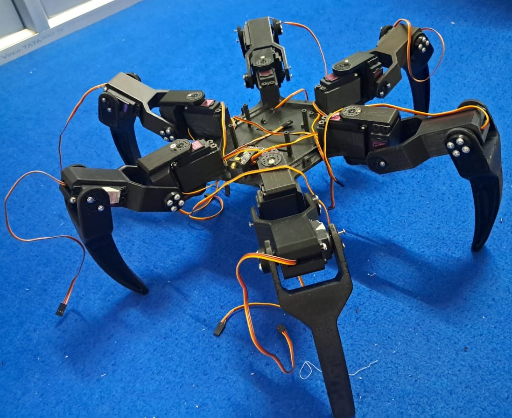
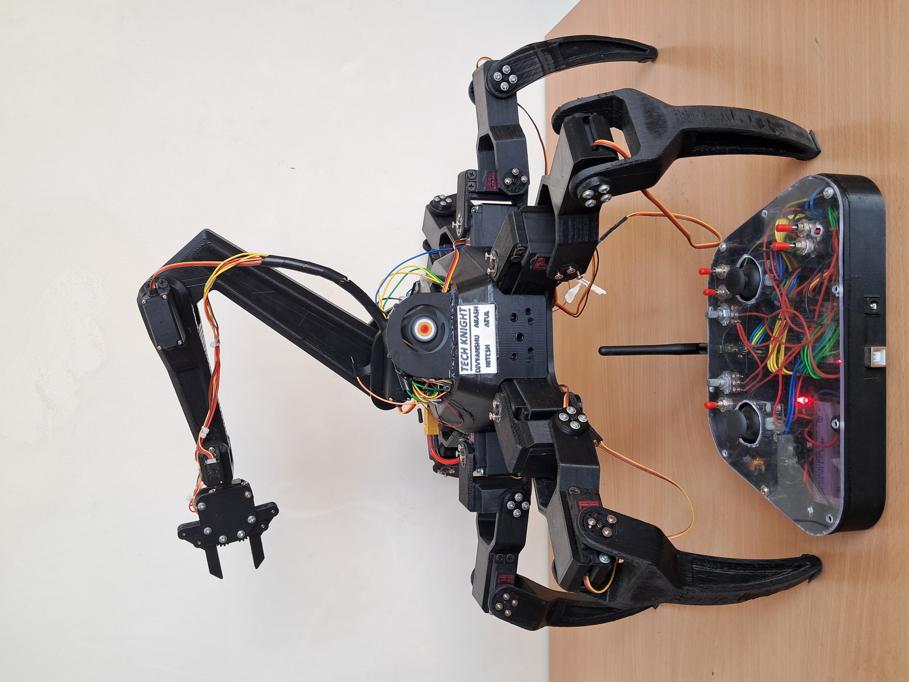

# 25-DOF Hexapod Robot 🤖

> B.Tech Capstone Project — AI-driven hexapod with autonomous navigation  
> and object manipulation. Published at NCETST-2026.


## 🦾 Overview

A fully custom 18-DOF hexapod with an integrated 4-DOF robotic arm (25 DOF total), built from scratch using 3D-printed PLA frame, MG996R servos, NRF24L01 PA/LNA wireless, and a YOLOv8 computer vision pipeline for autonomous obstacle detection and object manipulation.

## 📸 Gallery

<p align="center">
  
  &nbsp;&nbsp;
  
</p>
<p align="center">
  
</p>

## ✨ Features

- **Sinusoidal tripod gait** with IK/FK and smoothing parameters
- **4-DOF robotic arm** — dual shoulder, elbow, wrist, gripper
- **YOLOv8n vision pipeline** — 90.5% mAP@0.5, trained on custom dataset
- **NRF24L01 PA/LNA wireless** — custom 24-byte packet protocol
- **State machine** — SEARCHING → APPROACH → PICK → AVOID
- **Firmware v4.0** — receiver + transmitter with tuned gait constants

## 🔧 Hardware

| Component | Spec |
|-----------|------|
| Microcontroller | Arduino Mega 2560 |
| Servos | 18× MG996R (legs) + 3× MG90S (arm) |
| Wireless | NRF24L01 PA/LNA |
| Power | 3S LiPo + XL4016 Buck Converter |
| Frame | 3D-printed PLA |
| Vision | ESP32-CAM + Laptop YOLOv8n |

## 🧠 AI Pipeline

```
ESP32-CAM → YOLOv8n (Laptop) → USB Serial → Arduino Mega
                    ↓
    SEARCHING → APPROACH → PICK → AVOID
```

| Stage | Behavior |
|-------|----------|
| **SEARCHING** | Rotate in place until a pick target is detected |
| **APPROACH** | Steer and advance toward target using frame-center error |
| **PICK** | Stop and trigger pick when target fills ≥22% of frame |
| **AVOID** | Lateral strafe when obstacle area exceeds 16% |

Serial format to Mega: `{fwd},{strafe},{rot}\n` (values −1.0 … +1.0 @ 115200 baud).

## 📁 Project Structure

```
Hexapod_Robot/
├── receiver_v4.0/          # Arduino Mega firmware (hexapod + arm)
│   └── receiver_v4.0.ino
├── transmitter_v3.0/       # Arduino Uno controller firmware
│   └── transmitter_v3.0.ino
├── vision_pipeline/        # YOLOv8 training + inference scripts
│   ├── detect_and_send.py
│   └── requirements.txt
├── arm_control/            # 4-DOF arm servo constants
│   └── arm_servo_constants.h
├── docs/                   # Wiring diagrams, gait parameters
│   ├── wiring.md
│   └── gait_parameters.md
└── README.md
```

## 📄 Research Paper

Published at **NCETST-2026**:  
*"AI-Driven Multi-Terrain Hexapod Robot with Integrated Robotic Arm for Autonomous Navigation and Object Manipulation"*

## 🚀 Getting Started

### Arduino libraries

- [RF24](https://github.com/nRF24/RF24)
- Servo (built-in)

### Flash firmware

**Linux / macOS (arduino-cli):**

```bash
arduino-cli upload -p /dev/ttyUSB0 --fqbn arduino:avr:mega receiver_v4.0/receiver_v4.0.ino
arduino-cli upload -p /dev/ttyUSB1 --fqbn arduino:avr:uno transmitter_v3.0/transmitter_v3.0.ino
```

**Windows (Arduino IDE):** open each sketch folder, select board, upload.

### Run vision pipeline

```bash
cd vision_pipeline
pip install -r requirements.txt
python detect_and_send.py --port COM3 --webcam 0
# or ESP32-CAM stream:
python detect_and_send.py --port COM3 --stream http://192.168.1.10:81/stream
```

### Calibrate

1. Center joysticks at transmitter power-on.
2. **TG3** = `1` hexapod, `0` arm.
3. Mega Serial Monitor @ 115200 — confirm boot checklist.
4. **SW1** = E-STOP (hex mode).

See [docs/wiring.md](docs/wiring.md) and [docs/gait_parameters.md](docs/gait_parameters.md).

## 👥 Contributors

This project was developed by:
- **Divyanshu Kumar**
- **Akash Kumar**
- **Nitesh Sakarwar**
- **Atul Kumar**

## 📬 Contact

**Divyanshu Kumar** — dk5506934@gmail.com  
[LinkedIn](https://linkedin.com/in/divyanshukr004) · [Portfolio](https://divyanshu-2907.github.io/My_Portfolio/)

## 📄 License

MIT License.

---

